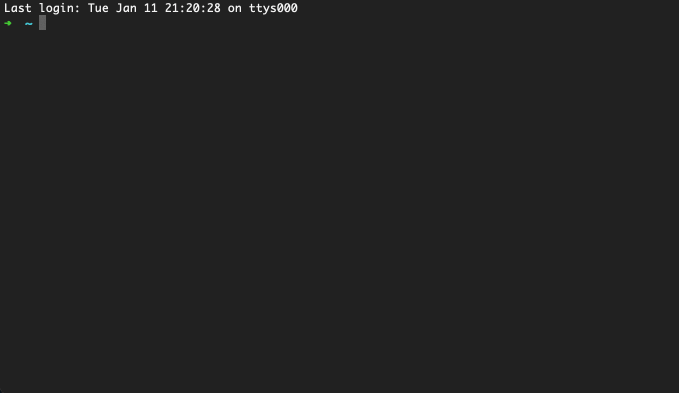

# sshw

ssh client wrapper for automatic login.

- Select / Search / Login


- Use Command Line Arguments


- Run / Start Command


- And if you need to manage a bunch of hosts under the same domain, such as

  ```
  hostA.your.domain.com
  hostB.your.domain.com
  hostC.your.domain.com
  ...
  ```

  you can write your domain in the config file (see `config` section below), and then you can just specify ***short hostname*** in the command line.

  ```shell
  sshw root@hostA
  ```

   `sshw` will concatenate domain name for you. FQDN won't be affected. (Note: make sure there is no `.` in your ***short hostname*** otherwise `sshw` would consider it as an FQDN.)


This is a fork of [yinheli/sshw](https://github.com/yinheli/sshw), with the following features added:

- Support setting default user/password
- Support short hostnames by setting up domain ( concatenated as `hostname.domain` )
- Support command line arguments
  ```shell
  sshw user:pass@host
  # use default password
  sshw user@host
  # use default user/password
  sshw host
  ```
- Support using flags before selecting host from list
  ```shell
  # use specified user and default password for selected host
  sshw -u admin
  # use specified user and password (will prompt for input) for selected host
  sshw -u admin -pass
  # use specified port for selected host
  sshw -p 33
  ```
- Or even using both (The flags have top priority)
  ```shell
  # will prompt for password
  sshw -pass user@host
  ```
- Run command on host
  ```shell
  # run command and get its output
  sshw -pass user@host "echo hello"
  # request a terminal and start command
  sshw -t -pass user@host "/bin/bash"
  ```
- Support more ciphers and kex algorithms

## install
```shell
go get https://github.com/lixvbnet/sshw
```

## config

put config file `.sshw.yml` in home directory or in the same directory of the binary.

[config example](./sshlib/config_example.yml):

```yaml
settings:
  domain: example.com
  logins:
    - user: admin
      password: password
    - user: testuser
      password: testpass
    - user: anotheruser
      password: anotherpass

default:
  user: root
  password: 123456


nodes:
  - name: nodeA
    alias: nodeA
    host: 192.168.1.10

  - name: nodeB
    alias: nodeB
    host: 192.168.1.11
    user: root
    password: Password
```

## usage
```shell
sshw [options] [target] [command]
```

where `target` is of the form `[user[:pass]@]host`. Run `sshw -h` for a full list of available options.
